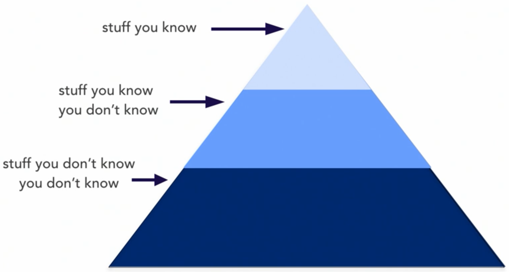
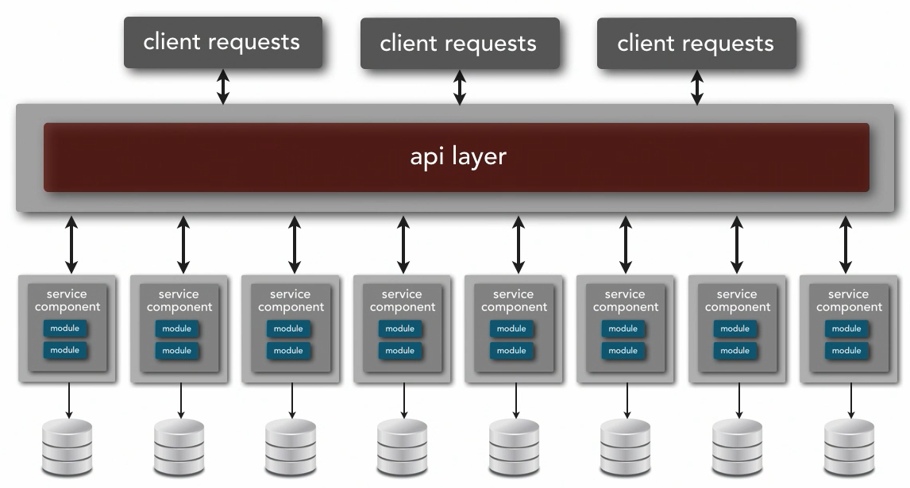
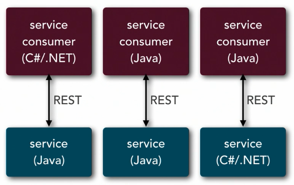
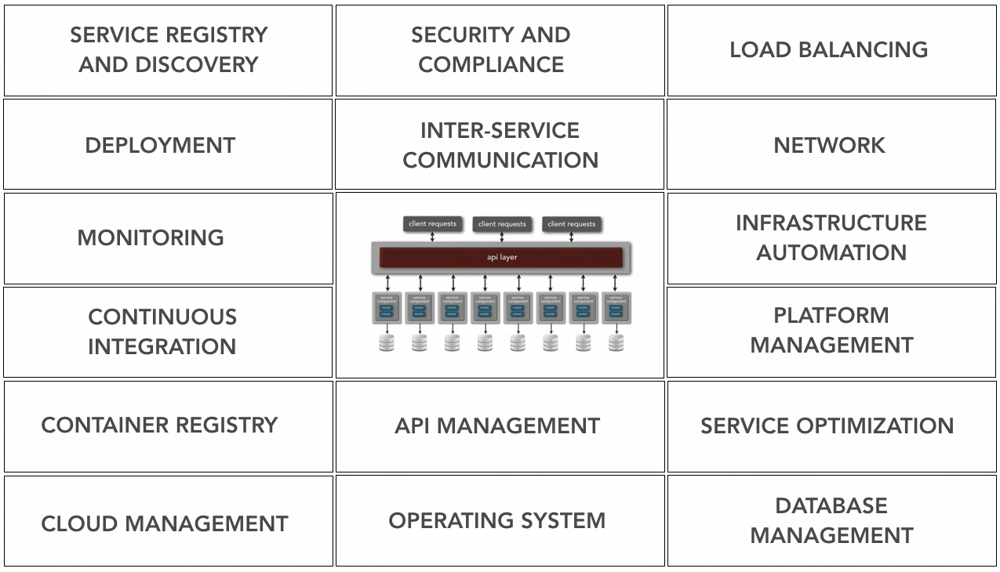
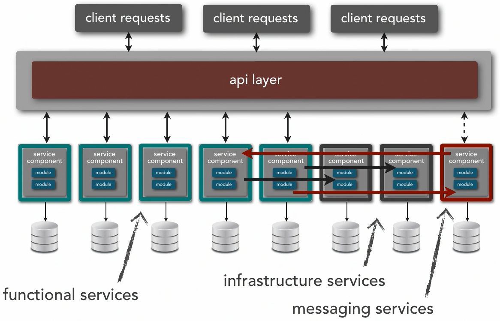
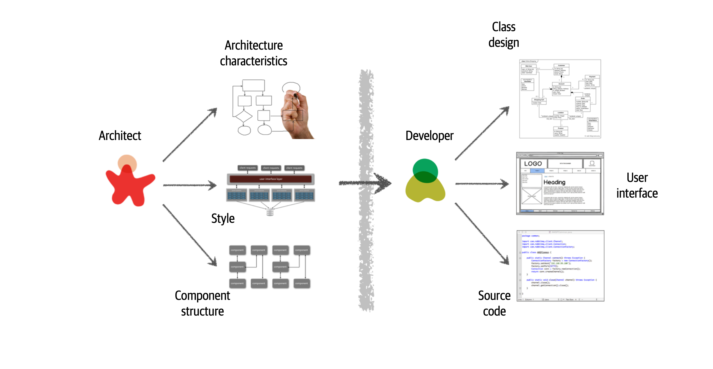
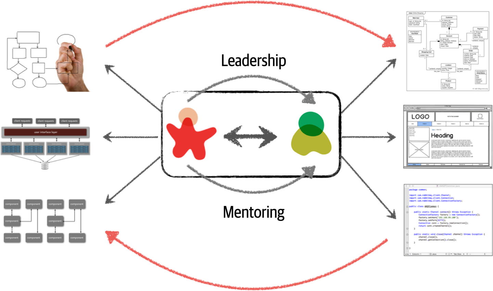

# What is Software Architecture

La arquitectura de software implica:
* Estructura
    * Patrones de arquitectura
    * Abarca las "ilities"
* Decisiones de arquitectura
    * only the business and services layers can access the persistence layer
    * all shared objects use by business objects in the business layer should reside in the shared service layer
* Principios de diseño
    * inter-service communications should leverage async messaging whenever possible to increse performance

# Understanding the expectations of an architect

Dentro del rol del arquitecto de software, lo que se espera que un arquitecto haga es:

1. Definir la arquitectura y los los principios de diseño para guiar las decisiones tecnológicas para la empresa.
2. Definir la viabilidad de una arquitectura a corto, mediano y largo plazo
3. Analyze technology and industry trends and keep current with the latest trends
4. Asegurar el cumplimiento de la arquitectura
5. Have exposure to multiple and diverse technologies, platforms and environments
6. Have a certain level of business domain expertise. Usa el lenguaje que usa el negocio
7. Possess exceptional interpersonal skills, including teamwork, facilitation and negotiation
8. Understand the political climate of the enterprise and be able to navigate the politics

# Thinking like an architect

Si pensamos en todo el conocimiento del universo, lo podemos dividir en tres grandes bloques:

* cosas que conoces
* cosas que sabes que no conoces
* cosas que no sabes que no conoces

Como arquitecto, tu foco está en las "cosas que sabes que no conoces"

La forma de convertirse en arquitcto es mostrando expertise en una variedad de diversas áreas técnicas.

## ¿Cuál es la línea divisioria entre diseño y arquitectura?

En realidad, no existe. 

El arquitecto:

* Identificar las caraterísticas arquitecturales (ilities)
* Identificar los patrones de arquitectura más adecuados para la aplicación (microservices, micro-kernel,...)
* Identificar los bloques principales de la arquitectura

El desarrollador:
* Diseñar los componentes que el arquitecto identificó
* Diseñar la experiencia de usuario
* Codificar

Tiene que haber una comunicación bidireccional entre arquitectos y desarrolladores.

Para que un arquitecto esté involucrado con el código fuente debe:
* Hacer experimentos (spikes)
* Hacer Pair Programming
* Code reviews

> El pair programming sería una buena práctica para mejorar la calidad del código y para formar a nuevos miembros del equipo.

# Identifying Architecture Characteristics

Tanto el desarrollador como el arquitecto están pendientes de la funcionalidad de una aplicación. Sin embargo, el arquitecto tiene responsabilidades adicionales, las cuales son las otras características arquitecturales de la aplicación:
* reliability
* scalability
* functionality
* performance
* availability

Los atributos de calidad no vienen de requerimientos, historias de usuario, etc. sino vienen del negocio. **Es un proceso de escuchar y traducir a requerimientos no funcionales**.

¿Cómo se relaciona la identificación de los atributos de calidad con los patrones arquitecturales?
Hay cierto patrones que promueven niveles altos de testability, deployability, performance y scalability. Por lo tanto, elegir el patrón equivocado no nos permitirá lograr los objetivos.

Entre los diferentes patrones tenemos:
* monolithic architectures
    * layered architecture
    * micro-kernel architecture
    * pipeline architecture
* distributed architectures
    * event-driven architecture
    * space-based architecture
    * microservices architecture
    * service-oriented architecture
    * service-base architecture

# Understanding Microservices Architecture

Es una arquitectura muy popular, gracias al éxito de compañías como Netflix, Amazon, etc. Esta arquitectura tiene beneficios en términos de escalabilidad y agilidad que otras arquitecturas no tienen.

## Características

### Distributed

* Cada uno de los servicios corren en sus propios procesos y tipicamente son desplegados individualmente
* Cada uno de sus componentes hablan unos a otros de una forma distribuida usando: 
    * Comunicación síncrona con protocolos como HTTP, REST o SOAP
    * Comunicación asíncrona usando **event queues**
* Interoperabilidad heterogénea consciente del protocolo
    * El consumidor necesita saber del protocolo de la cosa de la cual está consumiendo. Otras arquitectura remueven esta restricción usando middlewares. En la arquitectura de microservicios no hay middlewares.
    * Necesito saber si el endpoint que estoy llamado es REST, message queue u otro tipo de protocolo.
    * Heterogéneo implica que sistemas distintos construidos con distintos lenguajes se pueden comunicar
    * Interoperabilidad implica que una cosa pueda llamar a otra cosa

### Separately deployed

* Cada pieza (service component) puede ser desplegada de forma independiente
* El despliegue puede ser completamente automatizado
* La adopción de una arquitectura de microservicios implica el conocimiento de una serie de prácticas técnicas
* Una de las ventajas poderosa de esta arquitectura es el extremo despliegue desacoplado

### Service component 

* Los componente tienden a ser pequeños, por eso el nombre de microservices
* Tipos de service components
    * functional services: 
    * infraestructure services: monitoring, logging, authentication, authorization, etc. 
    * messaging services: 
* La comunicación es siempre point-to-point
* En esta arquitectura si no monitoreas un componente, no lo ves

Services templates
* Es la base sobre la que construyes un servicio
* Contiene infraestructura predefinida, cosas que queremos de manera consistente a través de toda la arquitectura
    * logging
    * monitoring
    * A&A: Authentication and Authorization
* El equipo extiende el service template y construye su funcionalidad dentro de él.
* Herramientas
    * Spring Boot
    * Dropwizard

Una de las ideas importante de la arquitectura de microservicios es: el acoplamiento es malo
La **duplicación** es preferible al acoplamiento
Los Services templates son los ideales para compartir código en cada servicio

¿Qué pasa si implementas A&A como microservicio?
* latencia en cada request: muchas peticiones al servicio de A&A. Esto es un candidato para colocarlo en un service template

### Bounded context

* Es la idea más fuerte detrás de este estilo arquitectónico
* Cualquier cosa de importancia en esta arquitectura debe ser encapsulada en un **bounded context**. Incluye data y persistencia
* Cada uno de los componentes actúa como LEGOs
* problema: data replication

### Data domains

* ?

### API Layer

* Fachada que expones endpoints al exterior
* endpoint proxy
    * apache
    * IIS
    * Nginx
    * Proxy server
    * ziproxy
* load balancer
    * Barracuda
    * neustar
    * f5
    * Citrix NetScaler
* gateway (integration hub)
    * apache camel
    * muleESB
    * 

### Event driven

* lo común es la comunicación asíncrona
* hacer rollbacks distribuidos es muy difícil

## ¿Cuál es le tamaño correcto para un microservicio?

Para determinar el tamaño, debemos considerar lo siguiente: 

* Cuál es el propósito de este microservicio
* transactions
* choreography

El término microservicio fue popularizado por un post de Martin Fowler y James Lewis

Microservice is a "label" not a "description"

Los componentes de un arquitectura microservicios incluyen la base de datos

## Service orchestration

* No existe un mediador
* ¿como se manejan las coordinaciones complejas entre servicios?
* Patrones
    * Front ochestrator: ponenmos algo de la responsabilidad de la mediación en el primer servicio que llamos en la serie
        * es optimista ¿que pasa si algo falla?
        * implica comunicación síncrona
    * event queues
        * fire-and-forget version
        * 

## Links
* https://learning.oreilly.com/library/view/microservices-vs-service-oriented/9781491975657/ch04.html

## Chapter 2. Architectural Thinking

A diferencia de un developer, un arquitecto debe desarrollar un "pensamiento arquitectónico". El pensamiento arquitectónico implica:
* Entender la diferencia entre arquitectura y diseño
* Tener una amplia gama de conocimientos técnicos y al mismo tiempo mantener un cierto nivel de profundidad técnica
* Entender, analizar y reconciliar trade-offs entre varias soluciones y tecnologías
* Entender los requisitos de negocio y traducirlos a características arquitectónicas

### Arquitectura vs Diseño

* La visión tradicional de arquitectura y diseño es la siguiente:

* Entender la diferencia entre arquitectura y diseño y ver cómo ambos se integran
* Para que la arquitectura funcione, los arquitectos y desarrolladores deben trabajar juntos (estar en el mismo equipo). El arquitecto debe proporcionar tutoría y entrenamiento a los desarrolladores del equipo.
* ¿Cuál es la línea que divide la arquitecta y el diseño? No existe. Ambos están integrados y deben mantenerse sincronizados 

