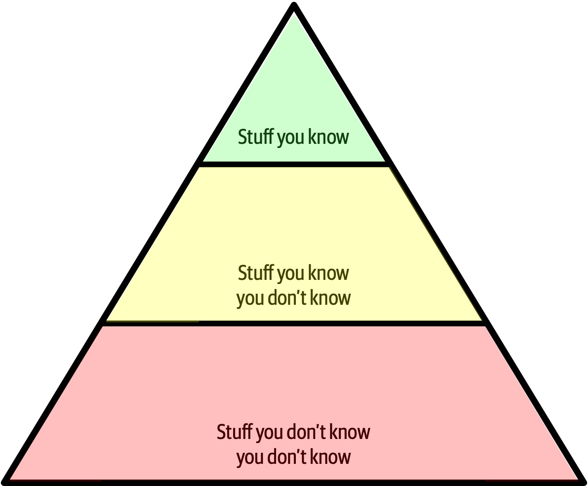
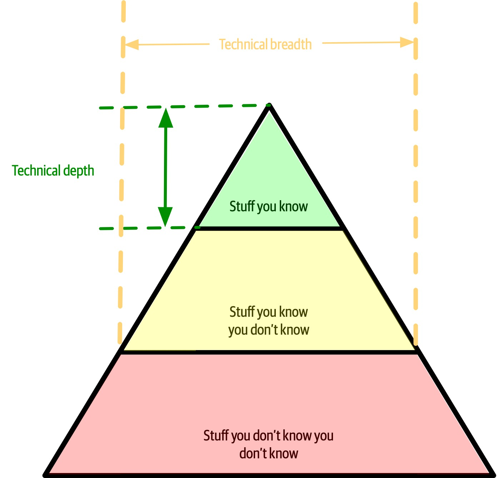

# Table of contents
1. [MODULE I](#ModuleI)
2. [MODULE II: FOUNDATIONS](#ModuleII)
    1. [Sub paragraph](#subparagraph1)


# MODULE I <a name="ModuleI"></a>

## 1. Introduction

### Defining Software Architecture

### Expectations of an Architect

### Intersection of Architecture and…

### Laws of Software Architecture

<hr />

# MODULE II: FOUNDATIONS <a name="ModuleII"></a>

Para comprender los importantes trade-offs en la arquitectura, los desarrolladores deben entender algunos conceptos y terminología básicos relativos a los componentes, la modularidad, el acoplamiento y la connascence.

## Chapter 2. Architectural Thinking

URL: https://learning.oreilly.com/library/view/fundamentals-of-software/9781492043447/ch02.html#ch-architectural-thinking

A diferencia de un developer, un arquitecto debe desarrollar un "pensamiento arquitectónico". El pensamiento arquitectónico implica:
* Entender la diferencia entre arquitectura y diseño
* Tener una amplia gama de conocimientos técnicos y al mismo tiempo mantener un cierto nivel de profundidad técnica
* Entender, analizar y reconciliar trade-offs entre varias soluciones y tecnologías
* Entender los requisitos de negocio y traducirlos a características arquitectónicas

### Arquitectura vs Diseño

* La visión tradicional de arquitectura y diseño es la siguiente:

* Entender la diferencia entre arquitectura y diseño y ver cómo ambos se integran
* Para que la arquitectura funcione, los arquitectos y desarrolladores deben trabajar juntos (estar en el mismo equipo). El arquitecto debe proporcionar tutoría y entrenamiento a los desarrolladores del equipo.
* ¿Cuál es la línea que divide la arquitecta y el diseño? No existe. Ambos están integrados y deben mantenerse sincronizados 


### Amplitud técnica
Mienras que un desarrollador debe tener una profundidad técnica para realizar su trabajo, un arquitecto debe tener una amplitud técnica para pensar desde un punto de vista de la arquitectura.

Cualquier individuo puede dividir todos sus conocimientos en tres secciones: cosas que sabe, cosas que sabe que no sabe y cosas que no sabe que no sabe.



Sin embargo, la naturaleza del conocimiento cambia a medida que los desarrolladores hacen la transición al papel de arquitecto. Una gran parte del valor de un arquitecto es una amplia comprensión de la tecnología y de cómo utilizarla para resolver problemas concretos. Por ejemplo, como arquitecto, es más beneficioso saber que existen cinco soluciones para un problema particular que tener conocimientos singulares en una sola.



Equilibrar su cartera de conocimientos en cuanto a profundidad y amplitud es algo que todo desarrollador debería considerar a lo largo de su carrera.


### Analyzing Trade-Offs

Pensar como arquitecto implica en evaluar los trade-offs de cada alternativa para elegir la mejor solución.

```
La arquitectura es lo que no puedes buscar en Google
```

Todo en la arquitectura es un trade-off, por lo que la famosa respuesta a cada pregunta de arquitectura es "depende". No se puede buscar en Google si los microservicios es el estilo de arquitectura correcto, porque depende del entorno de implementación, de los drivers de negocio, de la cultura de la empresa, del presupuesto, de los plazos, del conjunto de habilidades del desarrollador y muchos otros factores más.

El entorno, la situación y el problema de cda uno es diferente, de ahí que la arquitectura sea tan difícil.

```
Los programadores conocen los beneficios de todo y los trade-offs de nada. Los arquitectos necesitan entender ambas cosas.
```

Pensar arquitectónicamente implica observar los beneficios de una solución dada, pero también analizar los aspectos negativos.

Todo en la arquitectura tiene un trade-off: una ventaja y una desventaja. Pensar como arquitecto es pensar en estos trade-off y luego preguntarse "¿Qué es más importante: la extensibilidad o la seguridad?". La decisión entre las diferentes soluciones siempre dependerá de los drivers de negocio, el entorno y otra serie de factores más.

### Understanding Business Drivers

Pensar como arquitecto requiere entender los requerimientos de negocio para luego traducirlos en características de la arquitectura (escalabilidad, rendimiento, disponibilidad, etc.). Es una tarea compleja porque requiere conocimiento del negocio y buenas relaciones con los principales stakeholders de la empresa.

### Balancing Architecture and Hands-On Coding

Todo arquitecto debe codificar y tener un cierto nivel de profundidad técnica. Algunas formas de que un arquitecto practique la codificación son:
* Hacer pruebas de concepto (POCs): Esto permite validar una decisión de arquitectura teniendo en cuenta los detalles de la implementación.
* Abordar los casos de deuda técnica o de arquitectura.
* Automatizar tareas repetitivas. El equipo de desarrollo agradecerá la automatización.
* Hacer code reviews frecuentemente.

## Chapter 3. Modularity

URL: https://learning.oreilly.com/library/view/fundamentals-of-software/9781492043447/ch03.html#ch-modularity

### Definition

### Measuring Modularity

### From Modules to Components

Los módulos son una colección de código relacionado. Sin embargo, los arquitectos suelen pensar en términos de componentes, la manifestación física de un módulo.

## Chapter 8. Component-Based Thinking

URL: https://learning.oreilly.com/library/view/fundamentals-of-software/9781492043447/ch08.html#ch-component-based-thinking

<hr />

# MODULE III: ARCHITECTURE STYLES

## Chapter 9. Foundations

URL: https://learning.oreilly.com/library/view/fundamentals-of-software/9781492043447/ch09.html#ch-architecture-styles

Los estilos arquitectónicos (algunas veces llamados patrones de arquitectura) describen una relación nombrada de componentes que cubren una variedad de características de la arquitectura.

Los arquitectos deben estar familiarizados con los nombres básicos de los estilos arquitectónicos genéricos fundamentales.

### Fundamental Patterns

#### Big Ball of Mud

Se refiere a la ausencia de cualquier estructura arquitectónica.


#### Unitary Architecture

La arquitectura unitaria se refiere a un sistema específico que funciona en un hardware específico. 

Investigar: "embedded systems"
https://www.guru99.com/embedded-systems-tutorial.html


#### Client/Server

Con el tiempo, cuando las redes de computadoras se hicieron común, surgió la necesidad de separar en partes un sistema (sistema distribuido).

La arquitectura Cliente/Servidor consiste en separar la funcionalidad técnica entre el frontend y backend. A este estilo arquitectónico también se lo conocomo como **two-tier**.

Algunos sabores de estilo arquitectónico son:
* DESKTOP + DATABASE SERVER
* BROWSER + WEB SERVER
* THREE-TIER

### Monolithic Versus Distributed Architectures

Los estilos de arquitectura pueden clasificarse en dos tipos principales: monolíticos (una sola unidad de despliegue de todo el código) y distribuidos (múltiples unidades de despliegue conectadas a través de protocolos de acceso remoto.

Monolithic
* Layered architecture
* Pipeline architecture
* Microkernel architecture

Distributed
* Service-based architecture
* Event-driven architecture
* Space-based architecture
* Service-oriented architecture
* Microservices architecture

Los estilos de arquitectura distribuida, aunque son mucho más poderosos en términos de rendimiento, escalabilidad y disponibilidad que los estilos de arquitectura monolítica, tienen importantes trade-offs por este poder.

El primer grupo de problemas a los que se enfrentan todas las arquitecturas distribuidas se describen en las "falacias de la informática distribuida"
* Falacia #1: La red es confiable
* Falacia #2: La latencia es cero
* Falacia #3: El ancho de banda es infinito
* Falacia #4: La red es segura
* Falacia #5: La topología nunca cambia
* Falacia #7: El costo de transporte es cero
* Falacia #8: La red es homogénea

Otros problemas que enfrentan las arquitecturas distribuidas son:
* DISTRIBUTED LOGGING: 
* DISTRIBUTED TRANSACTIONS: Este es uno de los trade-offs de la arquitectura distribuida: alta escalabilidad, rendimiento y disponibilidad a costa de la consistencia y la integraidad de datos.
* CONTRACT MAINTENANCE AND VERSIONING: 

