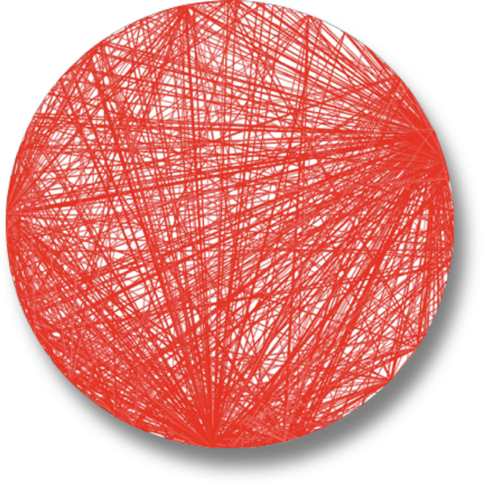

# Table of contents
TO-DO


# MODULE I <a name="ModuleI"></a>

## 1. Introduction

### Defining Software Architecture

### Expectations of an Architect

### Intersection of Architecture and…

### Laws of Software Architecture

<hr />

# MODULE II: FOUNDATIONS <a name="ModuleII"></a>

Para comprender los importantes trade-offs en la arquitectura, los desarrolladores deben entender algunos conceptos y terminología básicos relativos a los componentes, la modularidad, el acoplamiento y la connascence.

## Chapter 2. Architectural Thinking

URL: https://learning.oreilly.com/library/view/fundamentals-of-software/9781492043447/ch02.html#ch-architectural-thinking

A diferencia de un developer, un arquitecto debe desarrollar un "pensamiento arquitectónico". El pensamiento arquitectónico implica:
* Entender la diferencia entre arquitectura y diseño
* Tener una amplia gama de conocimientos técnicos y al mismo tiempo mantener un cierto nivel de profundidad técnica
* Entender, analizar y reconciliar trade-offs entre varias soluciones y tecnologías
* Entender los requisitos de negocio y traducirlos a características arquitectónicas

### Arquitectura vs Diseño

* La visión tradicional de arquitectura y diseño es la siguiente:

* Entender la diferencia entre arquitectura y diseño y ver cómo ambos se integran
* Para que la arquitectura funcione, los arquitectos y desarrolladores deben trabajar juntos (estar en el mismo equipo). El arquitecto debe proporcionar tutoría y entrenamiento a los desarrolladores del equipo.
* ¿Cuál es la línea que divide la arquitecta y el diseño? No existe. Ambos están integrados y deben mantenerse sincronizados 


### Amplitud técnica
Mienras que un desarrollador debe tener una profundidad técnica para realizar su trabajo, un arquitecto debe tener una amplitud técnica para pensar desde un punto de vista de la arquitectura.

Cualquier individuo puede dividir todos sus conocimientos en tres secciones: cosas que sabe, cosas que sabe que no sabe y cosas que no sabe que no sabe.


Sin embargo, la naturaleza del conocimiento cambia a medida que los desarrolladores hacen la transición al papel de arquitecto. Una gran parte del valor de un arquitecto es una amplia comprensión de la tecnología y de cómo utilizarla para resolver problemas concretos. Por ejemplo, como arquitecto, es más beneficioso saber que existen cinco soluciones para un problema particular que tener conocimientos singulares en una sola.


Equilibrar su cartera de conocimientos en cuanto a profundidad y amplitud es algo que todo desarrollador debería considerar a lo largo de su carrera.


### Analyzing Trade-Offs

Pensar como arquitecto implica en evaluar los trade-offs de cada alternativa para elegir la mejor solución.

```
La arquitectura es lo que no puedes buscar en Google
```

Todo en la arquitectura es un trade-off, por lo que la famosa respuesta a cada pregunta de arquitectura es "depende". No se puede buscar en Google si los microservicios es el estilo de arquitectura correcto, porque depende del entorno de implementación, de los drivers de negocio, de la cultura de la empresa, del presupuesto, de los plazos, del conjunto de habilidades del desarrollador y muchos otros factores más.

El entorno, la situación y el problema de cda uno es diferente, de ahí que la arquitectura sea tan difícil.

```
Los programadores conocen los beneficios de todo y los trade-offs de nada. Los arquitectos necesitan entender ambas cosas.
```

Pensar arquitectónicamente implica observar los beneficios de una solución dada, pero también analizar los aspectos negativos.

Todo en la arquitectura tiene un trade-off: una ventaja y una desventaja. Pensar como arquitecto es pensar en estos trade-off y luego preguntarse "¿Qué es más importante: la extensibilidad o la seguridad?". La decisión entre las diferentes soluciones siempre dependerá de los drivers de negocio, el entorno y otra serie de factores más.

### Understanding Business Drivers

Pensar como arquitecto requiere entender los requerimientos de negocio para luego traducirlos en características de la arquitectura (escalabilidad, rendimiento, disponibilidad, etc.). Es una tarea compleja porque requiere conocimiento del negocio y buenas relaciones con los principales stakeholders de la empresa.

### Balancing Architecture and Hands-On Coding

Todo arquitecto debe codificar y tener un cierto nivel de profundidad técnica. Algunas formas de que un arquitecto practique la codificación son:
* Hacer pruebas de concepto (POCs): Esto permite validar una decisión de arquitectura teniendo en cuenta los detalles de la implementación.
* Abordar los casos de deuda técnica o de arquitectura.
* Automatizar tareas repetitivas. El equipo de desarrollo agradecerá la automatización.
* Hacer code reviews frecuentemente.

## Chapter 3. Modularity

URL: https://learning.oreilly.com/library/view/fundamentals-of-software/9781492043447/ch03.html#ch-modularity

Algunas ideas generales:
* La modularidad es un principio organizador. 
* Muchas de las herramientas para analizar la arquitectura (metrics, fitness functions y visualizations) se basan en el concepto de modularidad.
* Si un arquitecto diseña un sistema sin prestar atención a cómo se conectan las piezas, terminan creando un sistema que presenta innumerables dificultades.
* Para usar una analogía física, los sistema de software modelan sistemas complejos que tienden a la entropía (desorden). La energía debes ser añadida a un sistema físico para preservar el orden. Lo mismo ocurre con los sistemas de software: los arquitectos deben gastar constantemente energía para asegurar una buena solidez estructural, lo que no ocurriría por accidente.

### Definition

Utilizamos la modularidad para describir una *agrupación lógica de código relacionado*, que podría ser un grupo de clases en un lenguaje OO o funciones en un lenguaje estructura o funcional.

La mayoría de lenguajes proporcionan mecanismos de modularidad:
* Paquete en Java
* Espacio de nombres en .NET
* ...

Los desarrolladores típicamente usan módulos como una forma de agrupar código relacionado. Por ejemplo, el paquete com.mycompany.customer en Java debería contener cosas relacionadas con los clientes.

Para las discusiones sobre arquitectura, usamos la modularidad como un término general para denotar una agrupación de código relacionado: clases, funciones, o cualquier otra agrupación. **Esto no implica una separación física, sino simplemente lógica**; la diferencia es a veces importante. 

### Measuring Modularity

Dada la importancia de la modularidad para los arquitectos, necesitan herramientas para entenderla. Afortunadamente, los investigadores crearon una variedad de métricas agnósticas del lenguaje para ayudar a los arquitectos a entender la modularidad. Nos centramos en tres conceptos clave: 
* Cohesión
* Acoplamiento
* Connascence

#### Cohesión

Es una medida de cuán relacionadas están las partes entre sí. Idealmente, un **módulo cohesivo** es aquel en el que todas las partes deben estar empaquetadas juntas, porque para romperlas en piezas más pequeñas sería necesario acoplar las partes entre sí mediante llamadas entre módulos para lograr resultados útiles.

```
El intento de dividir un módulo cohesivo sólo daría como resultado un mayor acoplamiento y una menor legibilidad.
Larry Constantine
```

Los científicos de la computación han definido una gama de medidas de cohesión, enumeradas aquí de mejor a peor:
* Functional cohesion
* Sequential cohesion
* Communicational cohesion
* Procedural cohesion
* Temporal cohesion
* Logical cohesion
* Coincidental cohesion

A pesar de tener siete variantes enumeradas, la cohesión es una métrica menos precisa que el acoplamiento. A menudo, el grado de cohesión de un módulo concreto queda a discreción de un arquitecto particular. 

Sorprendentemente, dada la subjetividad de la cohesión, los informáticos han desarrollado una buena métrica estructural para determinar la cohesión (o, más concretamente, la falta de cohesión). Un conjunto de métricas muy conocido, denominado conjunto de métricas orientadas a objetos de Chidamber y Kemerer, fue desarrollado por los autores homónimos para medir aspectos particulares de los sistemas de software orientados a objetos. 

La métrica **Chidamber and Kemerer Lack of Cohesion in Methods (LCOM)** mide la cohesión estructural de un módulo, típicamente un componente.


#### Acoplamiento

En 1979, Edward Yourdon y Larry Constantine publicaron *Structured Design: Fundamentals of a Discipline of Computer Program and Systems Design (Prentice-Hall)*, definiendo muchos conceptos centrales, incluyendo las métricas de acoplamiento aferente y eferente.

El acoplamiento aferente mide el número de conexiones entrantes a un artefacto de código (componente, clase, función, etc.). El acoplamiento eferente mide las conexiones salientes con otros artefactos de código. 

El libro anteriormente mencionado es anterior a la popularidad de los lenguajes orientados a objetos, centrándose en cambio en las construcciones de programación estructurada, como las funciones (no los métodos). También definió otros tipos de acoplamiento que no cubrimos aquí porque han sido suplantados por la conascencia.

¿Para qué sirve entender el acoplamiento?  Para ayudar a reestructurar, migrar o comprender una base de código.

#### Connascence

En 1996, Meilir Page-Jones publicó *What Every Programmer Should Know About Object-Oriented Design (Dorset House)* donde refinó las métricas de acoplamiento aferente y eferente reformulándolas para los lenguajes OO con un concepto que denominó **Connascence**. 

Dos componentes son **connascents** cuando deben cambiar de manera conjunta para que el sistema siga siendo válido: Si A cambia, entonces B debe cambiar.

TIPOS DE CONNASCENCE
* Static Connascence: acoplamiento a nivel de código fuente.
    * Connascence of Name (CoN)
    * Connascence of Type (CoT)
    * Connascence of Meaning (CoM) or Connascence of Convention (CoC)
    * Connascence of Position (CoP)
    * Connascence of Algorithm (CoA)
* Dynamic Connascence: Acoplamiento en tiempo de ejecución.
    * Connascence of Execution (CoE)
    * Connascence of Timing (CoT)
    * Connascence of Values (CoV)
    * Connascence of Identity (CoI)

CONNASCENCE PROPERTIES

Connascence es una herramienta de análisis para el arquitecto y los desarrolladores, y algunas propiedades de connascence ayudan a los desarrolladores a usarla sabiamente. La siguiente es una descripción de cada una de estas connascence properties:
* Strength
* Locality
* Degree

#### Unificando las métricas de acoplamiento y de Connascence

Hasta ahora, hemos discutido tanto el acoplamiento como la connascence, medidas de diferentes épocas y con diferentes objetivos. Sin embargo, desde el punto de vista de un arquitecto, estos dos puntos de vista se superponen. 


### From Modules to Components

Los módulos son una colección de código relacionado. Sin embargo, **los arquitectos suelen pensar en términos de componentes, la manifestación física de un módulo**.

## Chapter 4. Architecture Characteristics Defined

Además de los requisitos funcionales necesarios para desarrollar un sistema de software el arquitecto debe considerar otros factores para diseñar una solución de software. Una solución de software consiste de requerimientos funcionales y características arquitectónicas.


El arquitecto tiene la esponsabilidad clave de definir, descubrir y analizar de otro modo todas las cosas que el software debe hacer y que no están directamente relacionadas con la funcionalidad del dominio: las **características arquitectónicas**, las cuales describen los aspectos críticos para el éxito de la arquitectura, y por lo tanto del sistema en su conjunto.

Otros términos para referirse a las caractísticas arquitectónicas del software:
* Requerimientos no funcioanles
* Atributos de calidad

### Architectural Characteristics (Partially) Listed

Las característias de la arquitectura se pueden clasificar en las siguientes categorías:

* Operational Architecture Characteristics
    * Availability
    * Continuity
    * Performance
    * Recoverability
    * Reliability/safety
    * Robustness
    * Scalability
* Structural Architecture Characteristics: Relacionado a la estructura del código
    * Configurability
    * Extensibility
    * Installability
    * Leverageability/reuse
    * Localization
    * Maintainability
    * Portability
    * Supportability
    * Upgradeability
* Cross-Cutting Architecture Characteristics
    * Accessibility
    * Archivability
    * Authentication
    * Authorization
    * Legal
    * Privacy
    * Security
    * Supportability
    * Usability/achievability


### Trade-Offs and Least Worst Architecture

Las aplicaciones sólo pueden soportar algunas de las características de la arquitectura que hemos enumerado por una variedad de razones. 
* Cada una de las características soportadas requiere un esfuerzo de diseño
* El mayor problema radica en el hecho de que cada característica de la arquitectura a menudo tiene un impacto en otras.

```
Tip:
Nunca se busca la mejor arquitectura, sino la menos mala.
```

## Chapter 8. Component-Based Thinking

URL: https://learning.oreilly.com/library/view/fundamentals-of-software/9781492043447/ch08.html#ch-component-based-thinking

<hr />

# MODULE III: ARCHITECTURE STYLES

## Chapter 9. Foundations

URL: https://learning.oreilly.com/library/view/fundamentals-of-software/9781492043447/ch09.html#ch-architecture-styles

Los estilos arquitectónicos (algunas veces llamados patrones de arquitectura) describen una relación nombrada de componentes que cubren una variedad de características de la arquitectura.

Los arquitectos deben estar familiarizados con los nombres básicos de los estilos arquitectónicos genéricos fundamentales.

### Fundamental Patterns

#### Big Ball of Mud

Se refiere a la ausencia de cualquier estructura arquitectónica.



#### Unitary Architecture

La arquitectura unitaria se refiere a un sistema específico que funciona en un hardware específico. 

Investigar: "embedded systems"
https://www.guru99.com/embedded-systems-tutorial.html


#### Client/Server

Con el tiempo, cuando las redes de computadoras se hicieron común, surgió la necesidad de separar en partes un sistema (sistema distribuido).

La arquitectura Cliente/Servidor consiste en separar la funcionalidad técnica entre el frontend y backend. A este estilo arquitectónico también se lo conocomo como **two-tier**.

Algunos sabores de estilo arquitectónico son:
* DESKTOP + DATABASE SERVER
* BROWSER + WEB SERVER
* THREE-TIER

### Monolithic Versus Distributed Architectures

Los estilos de arquitectura pueden clasificarse en dos tipos principales: monolíticos (una sola unidad de despliegue de todo el código) y distribuidos (múltiples unidades de despliegue conectadas a través de protocolos de acceso remoto.

Monolithic
* Layered architecture
* Pipeline architecture
* Microkernel architecture

Distributed
* Service-based architecture
* Event-driven architecture
* Space-based architecture
* Service-oriented architecture
* Microservices architecture

Los estilos de arquitectura distribuida, aunque son mucho más poderosos en términos de rendimiento, escalabilidad y disponibilidad que los estilos de arquitectura monolítica, tienen importantes trade-offs por este poder.

El primer grupo de problemas a los que se enfrentan todas las arquitecturas distribuidas se describen en las "falacias de la informática distribuida"
* Falacia #1: La red es confiable
* Falacia #2: La latencia es cero
* Falacia #3: El ancho de banda es infinito
* Falacia #4: La red es segura
* Falacia #5: La topología nunca cambia
* Falacia #7: El costo de transporte es cero
* Falacia #8: La red es homogénea

Otros problemas que enfrentan las arquitecturas distribuidas son:
* DISTRIBUTED LOGGING: 
* DISTRIBUTED TRANSACTIONS: Este es uno de los trade-offs de la arquitectura distribuida: alta escalabilidad, rendimiento y disponibilidad a costa de la consistencia y la integraidad de datos.
* CONTRACT MAINTENANCE AND VERSIONING: 

